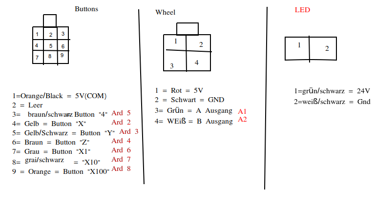

# Handwheel

Reads an connected control unit (pendant) for a CNC machine and convert the measured signals to keystrokes, send via USB to the main host controller. The used pendant has two single pole multi-way selector switches (one to select an axises and one as step multiplier).
Additional peripherals can be added and handled by extending the variable "controlsMap".

## Materials
Datasheet for the control unit (pendant):

Wiring between control unit and Arduino pins:

## Additional details:
Linux CNC keyboard control details
http://www.linuxcnc.org/docs/2.4/html/gui_axis.html#cap:Most-Common-Keyboard

More keyboard command details (keystrokes)
https://www.arduino.cc/en/Reference/KeyboardModifiers
